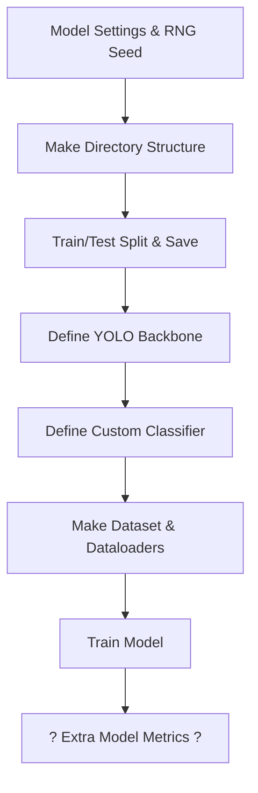

# GRinding Automated Classification Engine (GRACE)
**Author**: Sean Jackson, Data Science Summer Institute Scholar at Lawrence Livermore National Laboratory

Feel free to Contact the Author at:
 - jackson129@llnl.gov (expires August 9)
 - seank.jackson@utoronto.ca (my undergrad email, expires some time in 2027)

My Project Mentors are:
 - Mason Sage (sage6@llnl.gov)
 - Aldair Gongora (gongora1@llnl.gov)

## Description of Project
- This codebase contains my entire project for my summer internship as a DSSI Scholar at Lawrence Livermore National Laboratory (May through August of 2025). The goal of this project is to make an automated grinding/polishing system for project APEX, a self driving laboratory (SDL) aimed at significantly increasing throughput and research progress in alloy discovery. For my questions and details, please contact my mentors Mason Sage (project P.I.) and Aldair Gongora (AI and machine learning researcher and lead for the group).
- A detailed look at the data collection, model development, methods & procedures and results can be found in the paper for this project.

## Overview of Codebase
All training data and meta data is pending release from LLNL. 
<br>

### Required Dependencies to Install (Python 3.11.9)
 - matplotlib - pip install matplotlib
 - numpy - pip install numpy
 - pandas - pip install pandas
 - pillow - pip install pillow
 - torch, torchvision - pip install torch, torchvision
 - YOLOv8 - pip install ultralytics
 - tqdm - pip install tqdm
### Directories:
- **models**: contains the directories for the code for each of the developed binary classifiers (and some other models that were scrapped).
- **orchestrator**: This is where all of the training data is made. It loads in the serialized data from the data analysis notebook, divides it by grit, separates it into the grinind and polishing subsets, and then serializes it into clean, complete packages that can be read in by the models.

 ### Overview of Model File Structures
 ```mermaid
 flowchart TD
    ROOT["yolo_XYZ_cls"]
    DATASET["dataset"]
    METRICS["metrics"]
    RUNS["runs"]
    SAVED["saved_models"]
    TRAIN["train"]
    VAL["val"]
    META["metadata.csv"]
    TRAIN_META["train_metadata.csv"]
    VAL_META["val_metadata.csv"]
    TRAIN_0["0"]
    TRAIN_1["1"]
    VAL_0["0"]
    VAL_1["1"]
    METRICS_PKL["model metrics (.pkls)"]
    RUNS_PKL["model output files (.pkls)"]
    SAVED_PTH["saved model weights (.pth)"]
    DATASET_PY["dataset.py"]
    TRAIN_IPYNB["train_XYZ.py"]

    ROOT --> DATASET
    ROOT --> METRICS
    ROOT --> RUNS
    ROOT --> SAVED
    ROOT --> DATASET_PY
    ROOT --> TRAIN_IPYNB
    DATASET --> TRAIN
    DATASET --> VAL
    DATASET --> META
    DATASET --> TRAIN_META
    DATASET --> VAL_META
    TRAIN --> TRAIN_0
    TRAIN --> TRAIN_1
    VAL --> VAL_0
    VAL --> VAL_1
    METRICS --> METRICS_PKL
    RUNS --> RUNS_PKL
    SAVED --> SAVED_PTH
```
<br>
 - Each model writes it's own directory structure (**dataset**), with csv files for metadata (also conveniently separated into train/val) and directories for train/val subsets for the images (separated into **0** (Bad Grind/Polish) and **1** (Good Grind/Polish)). **metrics** contains some useful model metrics (not outputs from training). **runs** contains the .pkl files (currently removed) output from training & validation for each epoch and each saved model. **saved_models** contains all of the .pth(currently removed) files for the saved model weights. The **dataset.py** file conatins the unique model PyTorch Dataset for training and validation, and the specific class for augmentations. Finally, the **train_XYZ.py** notebook contains EVERYTHING for the model - the backbone, the classifier, the code to create the strucutres, the train test splits, the code to train, etc.

### Overview of the Main Notebook for Each Model:



Each model contains some settings for the model itself, outlined in the comments in the code. Then, each model clears it's training directory structure (to absolutely gaurantee no stale train/validation data) and creates the train test split (based off of the set model seed) and saves the files into the respective directories. The same exact YOLO backbone is then defined in each model notebook (bad design choice that should maybe be changed later). The custom classifier is defined using the model backbone. Then, the train and validation Dataset objects are created (passing in paths to the directory structure), and dataloaders are created from this. Finally, a cell is dedicated to the training loop. There are extra cells at the end for recording some other model metrics (inference time, perhaps overfitting tests, etc).
The models themselves will output their results as a dictionary. It is slightly different for each model, as some models have some auxiliary input / output metrics that are worth reporting.

### How to use this Code to Train a Model
To train a selected model (follow these steps exactly):
 - Set the desired seed in **seed_main.py** (which is in the ***orchestrator*** directory mentioned above). The seeds I used (and you should use) for the five trials (1-5) were 9001, 31415, 007, 42, 2003, repsectively. The file should just contain ```SEED = ...```
 - Now, navigate to your selected model training notebook.
 - Set the model settings at the top. For the polishing trials, set the ```train_type``` variable to either ```'grind'``` or ```'polish'```.
 - Set the ```variant_name``` to something useful and consistent. This will be the indentifier/tag used in the filenames for all of the model outputs. I set it to something like ```'trial_1_polish'```. Just keep it consistent across trials and the grind and polish datasets.
 - Now, RESTART THE TRAINING NOTEBOOK. In order for the seed and relavent modules to update properly, the notebook must be restarted and cache cleared.
 - Now, hit run all, and the model will train and output the relavent files into their respective directories. Done!

  ## License
This project is licensed under the GNU Affero General Public License v3.0 (AGPL-3.0).

You may copy, modify, and distribute this software under the terms of the AGPL-3.0 license.  
You must disclose your source code, including any modifications, when you:

- Distribute the software, or
- Make the software available to users over a network (software as a service).

Visit https://www.gnu.org/licenses/agpl-3.0.html> for more details.


 ### Release
 LLNL Code Release Number: LLNL-CODE-2015340
